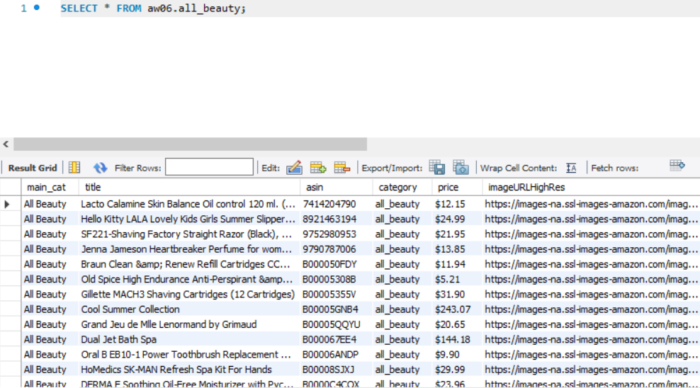
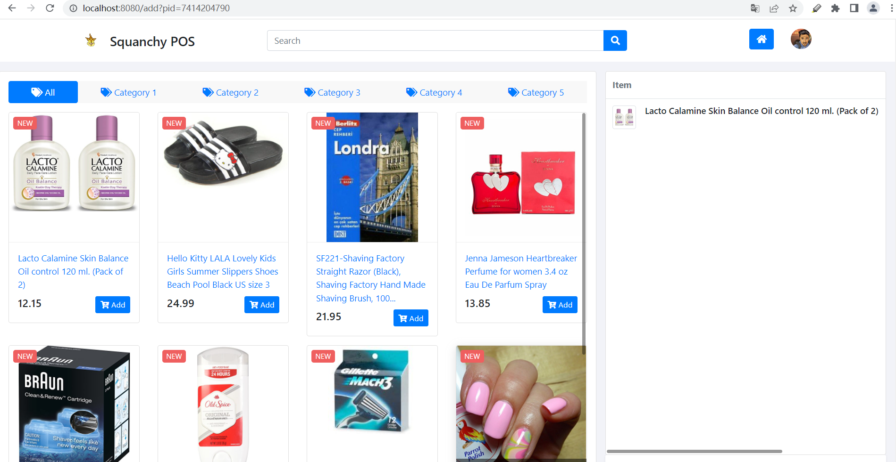

# 1 spring-batch 模块

使用管道-过滤器机制从本地文件中读取内容，处理后写入mysql数据库中

选取的文件：

meta_All_Beauty.json

meta_Gift_Cards.json

以All_Beauty为例

# 2 aw04

把作业四项目挪了进来，并修改了之前Jd.java，改为Amazon.java，之前通过访问某东来获取商品信息，现在通过访问模块一中存到本地数据库中的内容来获取products

运行并访问localhost:8080

